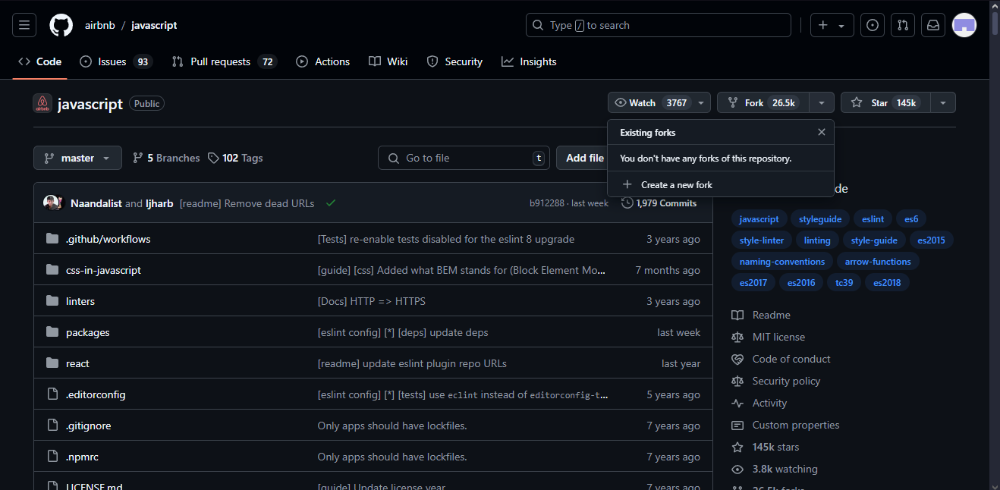
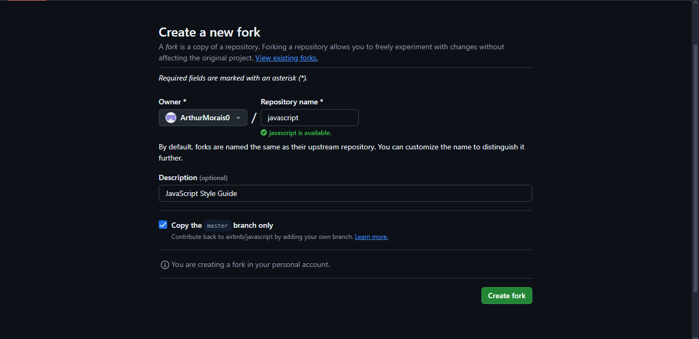
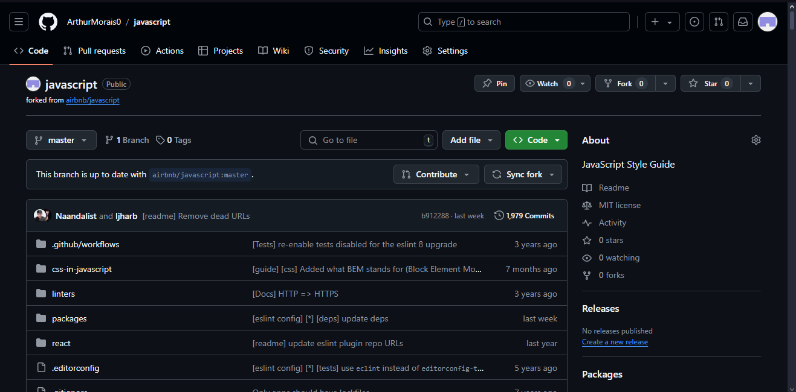

Dia 26 crie uma fork

# 1. Criando a fork

Clique em fork e depois em create fork

  
# 2. Criando a fork

Clique em Create fork

# Feito

# Utilidades da Fork

No GitHub, o **fork** é uma ferramenta útil para copiar um repositório existente para a sua própria conta, permitindo que você faça alterações independentemente do projeto original. 

1. **Contribuição para projetos de código aberto**: Fazer um fork permite que você contribua para projetos de outras pessoas. Você pode trabalhar em melhorias ou correções em seu próprio repositório e, depois, enviar essas mudanças como um *pull request* para que o repositório original as avalie e, potencialmente, as incorpore.

2. **Ambiente de desenvolvimento isolado**: Ao fazer um fork, você cria uma cópia do projeto que pode ser modificada sem afetar o repositório original. Isso é útil para testar novas ideias, corrigir bugs ou implementar novos recursos sem o risco de quebrar o projeto principal.

3. **Customização pessoal**: Você pode fazer um fork de um repositório para personalizar um projeto para suas próprias necessidades, sem a intenção de contribuir de volta para o repositório original. Isso é comum em scripts, temas e ferramentas que são amplamente reutilizados.

4. **Colaboração em equipe**: Forks são uma maneira eficaz de colaborar em equipes. Cada membro da equipe pode fazer um fork do repositório, trabalhar em suas próprias alterações, e depois solicitar a integração delas ao projeto principal.

5. **Controle de versão independente**: Mesmo que o projeto original seja removido ou suas permissões sejam alteradas, você ainda terá acesso à sua versão, o que garante controle sobre o que você já desenvolveu.
